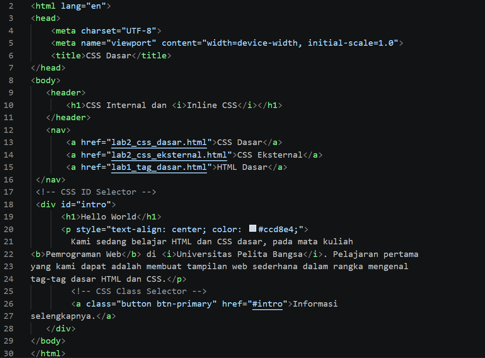
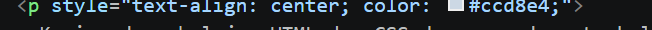
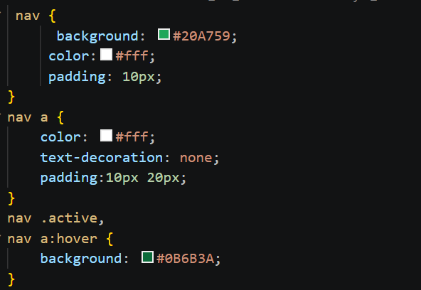
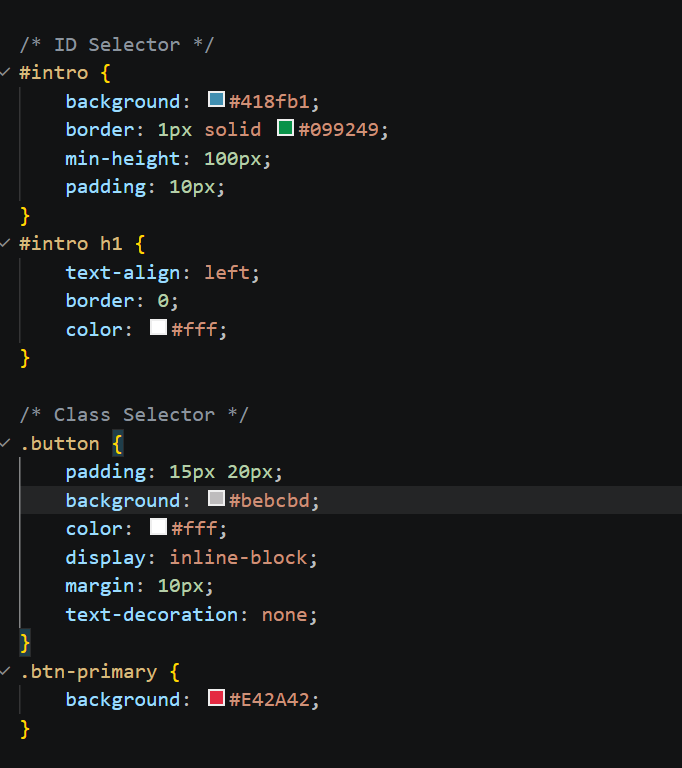
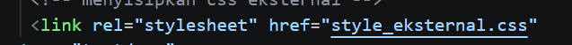
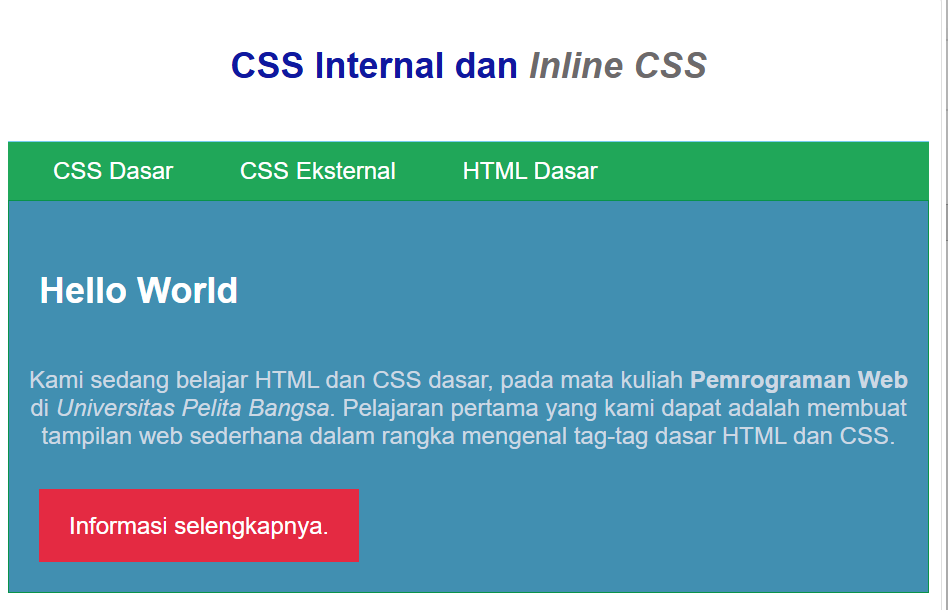

# Lab3Web.
## 1. Struktur HTML Dasar
Pada tahap ini, dibuat file `lab2_css_dasar.html` yang berisi struktur dasar halaman web.
**Screenshot:**

## 2. Internal CSS
Internal CSS digunakan untuk mengatur tampilan HTML melalui tag <style>.
**Screenshot:**

## 3. Inline CSS
Inline CSS diterapkan langsung pada elemen HTML menggunakan atribut style.
**Screenshot:**

## 4. Selector Navigasi
Selector nav, nav a, dan :hover digunakan untuk mengatur tampilan navigasi dan tautan.
**Screenshot:**

## 5. ID Selector dan Class Selector
ID selector menggunakan #, sedangkan class selector menggunakan tanda titik (.).
**Screenshot:**

## 6. CSS Eksternal
Tag <link> digunakan untuk menghubungkan file HTML dengan style_eksternal.css.
**Screenshot**

## 7 Hasil Praktikum
### Hasil Praktikum
Hasil praktikum menunjukkan bahwa penerapan Internal CSS dan Inline CSS berhasil mengubah tampilan halaman web. Halaman menampilkan judul, menu navigasi berwarna hijau, area konten berwarna biru, dan tombol informasi berwarna merah. Dengan penerapan CSS, tampilan halaman web menjadi lebih menarik, terstruktur, dan mudah dibaca.
**Screenshoot**

